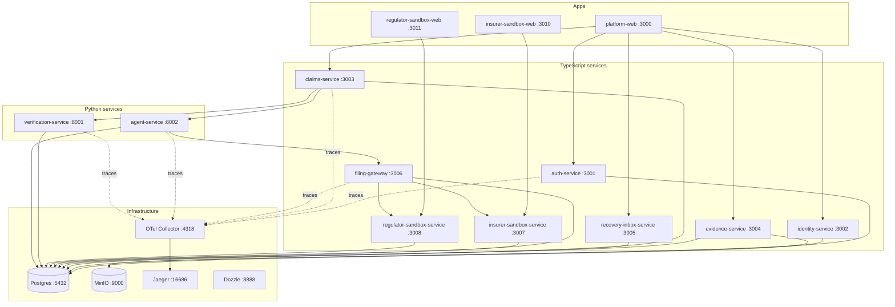

# Architecture

RecoveryAI is a monorepo of ten services and three applications. This document is the
map; `implementation-plan.md` is the specification.

## Runtime topology

## Service ownership

| Service | Port | Database | Owns |
|---|---|---|---|
| auth-service | 3001 | `recoveryai_auth` | users, sessions, tokens |
| identity-service | 3002 | `recoveryai_identity` | profiles, KYC cases |
| claims-service | 3003 | `recoveryai_claims` | policies, claims, items, events, reviews, mandates, authorizations, filings, escalations |
| evidence-service | 3004 | `recoveryai_evidence` | documents, metadata, object storage |
| recovery-inbox-service | 3005 | `recoveryai_inbox` | victim inbox messages |
| filing-gateway | 3006 | `recoveryai_filing_gateway` | outbound filing, receipts, webhook intake |
| insurer-sandbox-service | 3007 | `recoveryai_insurer_sandbox` | fictional insurer |
| regulator-sandbox-service | 3008 | `recoveryai_regulator_sandbox` | fictional grievance/ombudsman body |
| verification-service | 8001 | `recoveryai_verification` | verification runs and signals |
| agent-service | 8002 | `recoveryai_agent` | agent runs, policy chunks, negotiation sessions |

No service reads another's tables (plan Section 4.7).

## Shared libraries

| Package | Purpose |
|---|---|
| `@recoveryai/ts-config` | Base, service and Next.js TypeScript configs |
| `@recoveryai/eslint-config` | Shared flat ESLint config encoding the plan's standards |
| `@recoveryai/config-ts` | Startup environment validation (Section 4.6) |
| `@recoveryai/observability-ts` | Pino logging, OTel tracing, readiness registry, error envelope |
| `@recoveryai/service-runtime` | Elysia app factory, traced server, health endpoints, diagnostics |
| `recoveryai-common` (Python) | Settings, structlog logging, OTel tracing, FastAPI app factory |

## Cross-cutting behaviour

Every service, in both runtimes, provides:

- `GET /health/live` — process is alive.
- `GET /health/ready` — real dependency round-trips; 503 when a required one is down.
- A request ID on every request and response (`x-request-id`), generated when absent.
- A server span continuing any inbound `traceparent`, exported via OTLP.
- One structured JSON access log per non-health request with `request_id`, `trace_id`,
  `span_id`, `route`, `method`, `status_code`, `duration_ms`.
- The canonical error envelope on every error path.
- Secret and PII redaction in logs.

## Local URLs

| What | URL |
|---|---|
| Victim portal | http://localhost:3000 |
| Insurer sandbox | http://localhost:3010 |
| Regulator sandbox | http://localhost:3011 |
| Jaeger (traces) | http://localhost:16686 |
| Dozzle (logs) | http://localhost:8888 |
| MinIO console | http://localhost:9001 |
