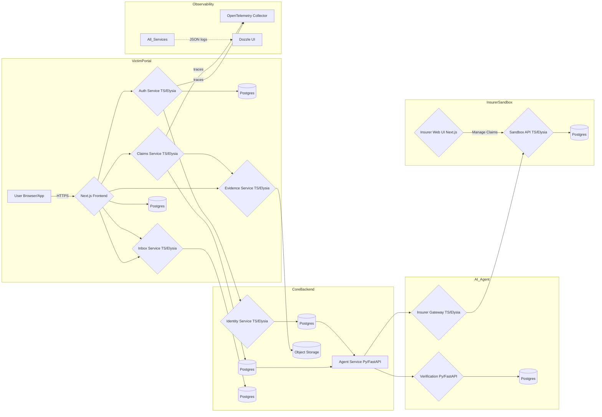
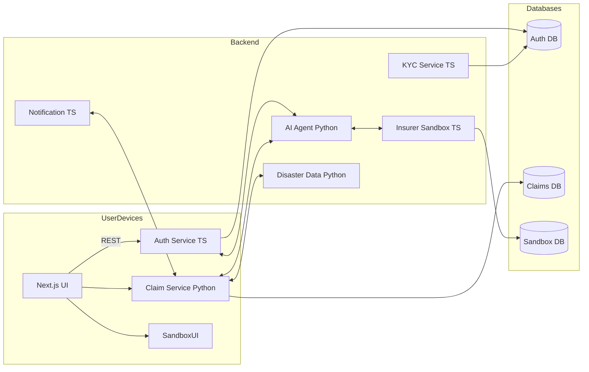
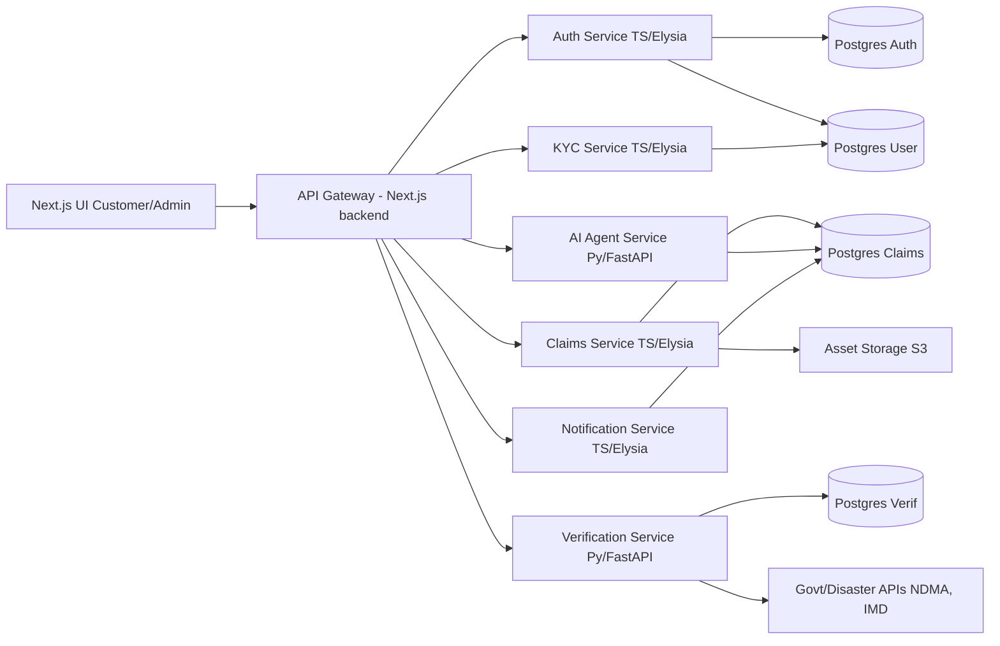
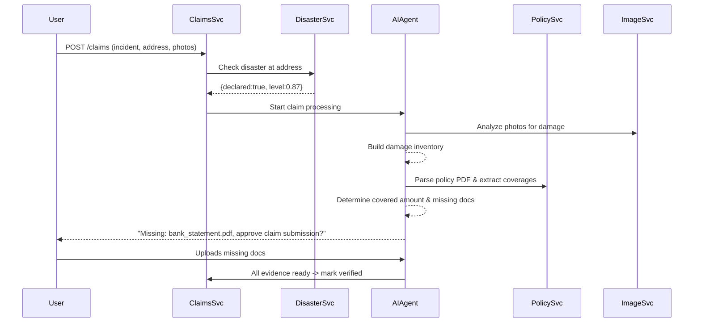
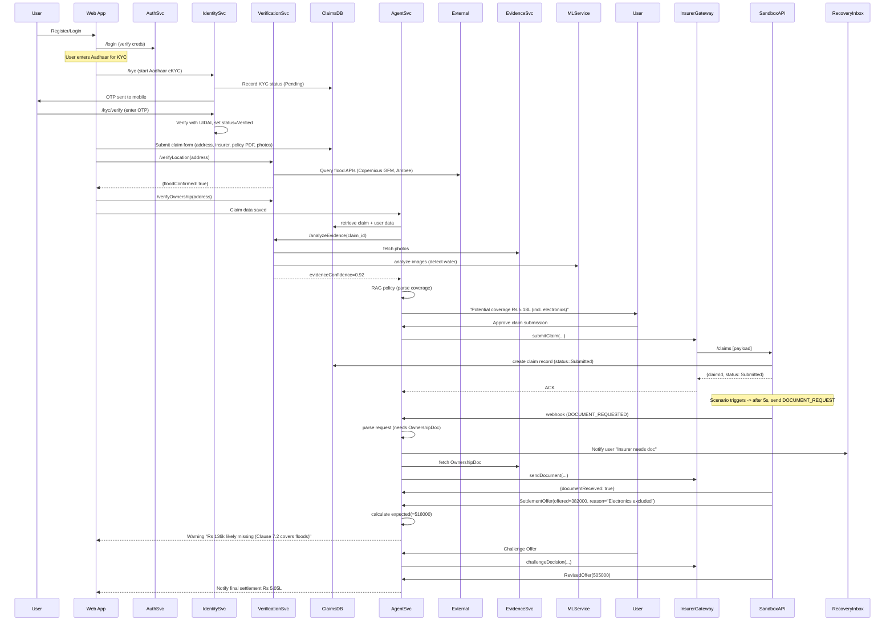
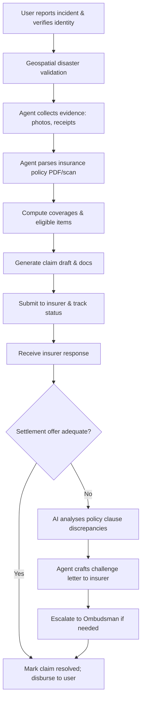
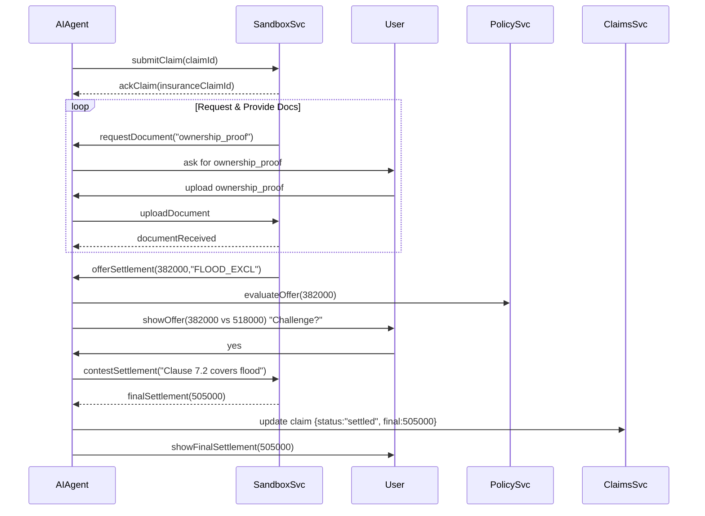
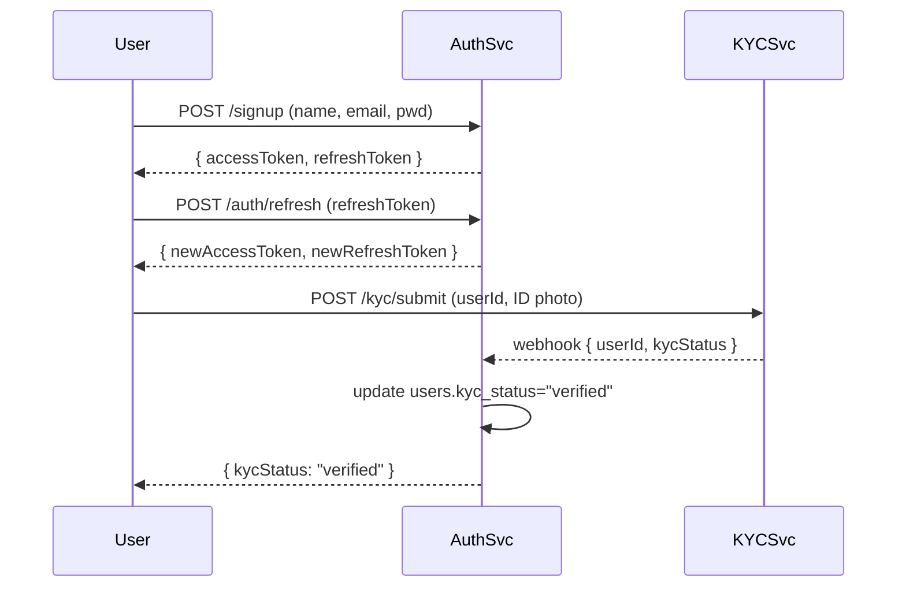
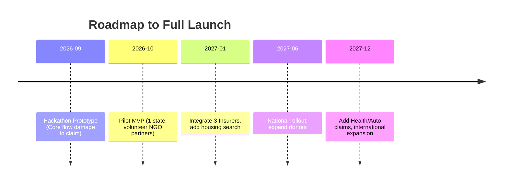

# RecoveryAI — Consolidated Research

> **What this is.** A single, lossless merge of the four deep-research reports that previously lived in `/research`
> (`deep-research-report (1..4).md`). Nothing has been dropped: every service breakdown, schema sketch, diagram,
> API contract, regulatory note, persona, KPI, roadmap and open question from the four reports is represented here,
> deduplicated and organised by topic.
>
> **Provenance labels.** Where the reports differ (or where only one report says something), the source is marked:
>
> | Label | Source report | Character of the report |
> |---|---|---|
> | **R1** | `deep-research-report (1).md` | Systems/architecture-heavy. Monorepo layout, per-service DB fields, full end-to-end sequence diagram, observability, IRDAI/Aadhaar KYC detail. |
> | **R2** | `deep-research-report (2).md` | Contract-heavy. Concrete SQL DDL, REST endpoint lists, sandbox scenario YAML, hour-level MVP estimates. |
> | **R3** | `deep-research-report (3).md` | Pragmatic/product-engineering. Deferred KYC strategy, multi-agent roles, folder structures, trade-offs and open questions. |
> | **R4** | `deep-research-report (4).md` | PRD/business. Vision, personas, competitor table, donor model, legal/regulatory, KPIs, accessibility, partnerships, hackathon framing. |
>
> **Relationship to the implementation plan.** `implementation-plan.md` is the executable spec and is authoritative
> wherever it contradicts this file. This document is the *why* and the *background*; the plan is the *what* and *how*.
> The final section here lists every conflict between the reports and how the plan resolves it.

---

## Table of contents

1. [Product vision](#1-product-vision)
2. [Target users and personas](#2-target-users-and-personas)
3. [Core value propositions](#3-core-value-propositions)
4. [Competitive landscape](#4-competitive-landscape)
5. [Feature set — MVP and roadmap](#5-feature-set--mvp-and-roadmap)
6. [System architecture](#6-system-architecture)
7. [Service catalogue](#7-service-catalogue)
8. [Data models](#8-data-models)
9. [API contracts](#9-api-contracts)
10. [Claim verification pipeline](#10-claim-verification-pipeline)
11. [AI agent design](#11-ai-agent-design)
12. [Negotiation, disputes and escalation](#12-negotiation-disputes-and-escalation)
13. [Insurer sandbox and scenario simulation](#13-insurer-sandbox-and-scenario-simulation)
14. [Authentication, KYC and identity](#14-authentication-kyc-and-identity)
15. [Observability](#15-observability)
16. [Frontend architecture, UX and i18n](#16-frontend-architecture-ux-and-i18n)
17. [Security, privacy and data protection](#17-security-privacy-and-data-protection)
18. [Legal and regulatory constraints](#18-legal-and-regulatory-constraints)
19. [Donor and crowdfunding model](#19-donor-and-crowdfunding-model)
20. [Testing strategy and mock data](#20-testing-strategy-and-mock-data)
21. [Engineering practices, CI/CD and DevOps](#21-engineering-practices-cicd-and-devops)
22. [Metrics and KPIs](#22-metrics-and-kpis)
23. [Failure modes and mitigations](#23-failure-modes-and-mitigations)
24. [Accessibility and low-connectivity design](#24-accessibility-and-low-connectivity-design)
25. [Partnerships](#25-partnerships)
26. [Phased roadmaps and effort estimates](#26-phased-roadmaps-and-effort-estimates)
27. [Hackathon scope and demo script](#27-hackathon-scope-and-demo-script)
28. [External data sources and provider catalogue](#28-external-data-sources-and-provider-catalogue)
29. [Conflicts between reports and how the plan resolves them](#29-conflicts-between-reports-and-how-the-plan-resolves-them)

---

## 1. Product vision

**RecoveryAI** (name from R4) is an AI-driven disaster-recovery platform that guides climate-impacted individuals
end-to-end through insurance claims and the broader recovery process. A victim verifies identity and location,
uploads damage evidence (photos, videos, receipts) and their policy; the system then autonomously prepares the claim,
submits it, chases the insurer, evaluates the settlement offer, and negotiates or disputes underpayment.

Framing (R4):

- *"A world where climate disasters don't leave victims lost in paperwork."*
- The platform is **free for victims**; costs are covered by donors/CSR/grants, not by success fees (contrast:
  Insurance Samadhan's ₹999 + 20% success fee).
- Beyond claims, the same agent points survivors at temporary housing, jobs, replacement of lost documents,
  and government relief schemes.
- Climate-resilience thesis: insurance is a recognised climate-adaptation instrument (IPCC, UNDRR). UNDRR's 2025
  report argues targeted investment in risk transfer combined with risk reduction can break downward spirals of
  disaster dependency; RecoveryAI is an investment in the *administrative* bottleneck of that transfer.
- Macro gap cited: up to **62% of disaster losses are uninsured**, and even insured losses often go unclaimed or
  under-claimed because of paperwork friction.
- Start with natural disasters (flood first, then cyclone/fire/earthquake); the same pipeline generalises to any
  insurance claim later (health, motor, travel).

All four reports agree on the same core loop: **verify → digitise → parse policy → assemble claim → submit →
track → evaluate offer → contest underpayment → settle**.

---

## 2. Target users and personas

R4's persona table (verbatim content):

| Persona | Role/Context | Goals & Needs | Tech literacy | Pain points |
|---|---|---|---|---|
| **Asha** (38, Kerala farmer) | Disaster victim; flooded rural home; owns home & small-shop insurance | Quickly claim insurance, find temporary shelter/job, rebuild livelihood | Limited (smartphone only, local language) | Overwhelmed by forms, language barrier, lost documents, no cash |
| **Rahul** (25, NGO volunteer) | First responder/NGO worker helping flood victims in Assam | Verify victim identities, assist claim submissions, report data | Moderate (app-savvy, local dialects) | Coordinating volunteers, tracking who has been helped, avoiding fraud |
| **Priya** (42, CSR manager) | Donor/corporate sponsor funding climate relief | Donate efficiently, see impact of funds, improve corporate giving story | High | Lack of transparency in relief projects, measuring outcomes |

Notes per group (R4):

- **Disaster victims** (primary). Often low-income, rural or elderly. Need a mobile-first, simple UI, local languages,
  audio help, and explicit reassurance the service is free. Trust is essential — verification (Aadhaar, NGO
  attestation) and visible data security matter. They want hand-holding at every step.
- **NGOs / first responders.** Run relief camps; can refer victims, assist KYC (attesting who is a genuine victim),
  and spread awareness. Need dashboards showing how many victims were helped and how to allocate resources.
- **Donors / philanthropists / CSR.** Fund operations. Need donor UX (progress bars, case stories, tax receipts) and
  evidence of impact (settlements achieved, families aided).

Secondary internal personas implied by R1–R3: the **RecoveryAI staff reviewer/admin** (works the manual-review queue,
resolves low-confidence verifications) and the **insurer employee** (works the claim in the insurer's own system —
simulated by the sandbox).

---

## 3. Core value propositions

From R4 (with supporting points from R1–R3):

1. **Autonomous claims advocate.** The agent reads each policy, identifies coverages and exclusions, and executes
   claim tasks with minimal user effort. Existing services advise or assign a human case manager; this one *executes*
   the workflow and flags underpayment itself.
2. **Zero cost to victims.** No brokers, no legal fees, no success fee. Equity: the poorest flood-affected farmer gets
   "premium" claims help.
3. **Crowd-resourced relief.** Donors fund the annual budget (servers, model API calls, staff), creating a continuous
   funding stream rather than one-off donations.
4. **Holistic recovery guidance.** Beyond insurance: housing, jobs, documentation, benefits ("You qualify for ₹50k
   government aid; 3 temp housing options nearby; 2 jobs matched to your skills").
5. **Rapid and transparent.** Contrast with the usual 30+ day survey wait. Real-time status for both victim and donor.
   IRDAI itself encourages digital communication for disaster claims.
6. **Scalable adaptation tool.** Solving the administrative bottleneck scales insurance's value as adaptation, and
   improves financial literacy (victims learn what their policy actually covers, in plain language).

---

## 4. Competitive landscape

R4's comparison table (verbatim content):

| Product | Focus & model | AI/automation | Cost to victims | Disaster focus | Crowdfunded | Notes |
|---|---|---|---|---|---|---|
| **RecoveryAI (ours)** | End-to-end AI agent for claims & recovery, free for victims, donor-funded | Multi-modal AI (CV, LLM) driving the entire flow | Free (₹0) | Yes (climate disasters) | Yes (NGOs/CSR) | Novel concept; vision beyond hackathon |
| **Insurance Samadhan (India)** | Claims-assistance company (motor, health, etc.) | Human advisors; some automation behind the scenes | ₹999 registration + 20% success fee | No | No | Established (Noida); success-fee model, no AI agent |
| **Ditto (India)** | Claims concierge via SMS/web with human follow-up | Virtual assistants & staff (some chatbot) | Subscription (monthly) | No | No | Claims managers coordinate with insurers; fee-based |
| **ClaimBuddy (India)** | Health-insurance claims support | Online portal with guidance | Free (B2B via providers) | No | No | Patient-support network; not fully automated |
| **Cognizant Property Insights** | AI SaaS for *insurers* processing catastrophe claims | CV on aerial/satellite imagery | B2B SaaS (insurer pays) | Yes (hurricanes, floods) | No | Speeds insurer payouts; victim-side unaffected |
| **Tractable (global)** | Car/home damage assessment AI | CV models for damage estimation | B2B to insurers/shops | No | No | Repair-cost estimation from photos |
| **Lemonade (US)** | Insurer with AI claims bot | AI "Jim" handles simple claims | Premiums paid | No | No | Only covers Lemonade's own customers |
| **General apps** (PolicyBazaar, MyClaims) | Policy comparison/sales | Limited | Free/lead fees | No | No | Do not handle claims |

Positioning conclusion (R4): RecoveryAI is distinguished by being **victim-facing, end-to-end automated, no-cost and
climate-focused**. The closest analogues (Insurance Samadhan, Ditto) are fee-for-service and manual; insurer tools
(Cognizant, Tractable) sit on the corporate side of the table.

---

## 5. Feature set — MVP and roadmap

### 5.1 MVP features (R4, hackathon → ~3 months)

- **User onboarding & verification** — Aadhaar eKYC (OTP) + address proof; geolocation to confirm disaster zone using
  flood maps/satellite. For the hackathon this may be mocked (enter address → "in disaster zone").
- **Incident report + evidence collection** — upload photos/videos of damage plus free-form description. Automated
  tagging detects building, car, electronics and visible damage (CV models or vision-LLM prompts).
- **Policy upload & parsing** — user uploads policy PDF/screenshot; AI extracts sum insured, add-ons, clauses via
  OCR + LLM/retrieval; computes "potential claim value = ₹X lakh".
- **Claim preparation agent** — a "Prepare Claim" action: the agent compiles required documents and answers,
  auto-fills insurer claim forms (mock), and writes the claim letter/email.
- **Mock submission & settlement** — simulate insurer response ("offering ₹A" vs "eligible ₹B"); agent highlights the
  discrepancy ("₹C lakh deduction spotted") and offers "Challenge settlement", with an example output letter.
- **Recovery dashboard** — one screen: "Documents collected 4/5, claim submitted, settlement pending, next due in
  7 days, 2 pending relief forms", plus housing/jobs hints.

### 5.2 Prioritised roadmap (R4)

| Priority | Feature | Description | Similar existing? |
|---|---|---|---|
| **MVP** | Disaster verification | Geospatial check vs official disaster maps; NGO attestation upload (NDMA data, local govt alerts) | None; novel use of GIS in personal claims |
| **MVP** | AI damage vault | Automated extraction of damaged items & values from photos/receipts ("washing machine — destroyed" + estimate) | Partial: Cognizant Property Insights assesses damage for insurers, not itemised per user |
| **MVP** | Agentic claim flow | RAG-powered policy clause lookup; auto form fill; deadline reminders; one-click escalate | Insurance Samadhan/Ditto are manual; no known fully autonomous agent |
| **High** | Multi-hazard support | Extend from floods to cyclones, fires, etc. with different disaster maps | Generic claims platforms exist; disaster focus is unique |
| **High** | NGO integration portal | NGOs register, refer victims, verify identity/needs (digital sign-off) | NGO CRMs exist, none tied to AI claims |
| **Medium** | Temp housing & jobs finder | Integrate local housing listings (shelters, rentals) and job portals | Partly exists as govt schemes; no unified app |
| **Medium** | Government schemes integration | Auto-apply for known relief schemes (PMFBY, calamity loans) from user profile | No unified portal |
| **Medium** | Multi-language mobile app | Hindi, Bengali, Tamil, etc.; voice assistance | Generic multilingual apps exist; needs context tailoring |
| **Low** | Offline mode / SMS support | Key steps via SMS/USSD ("CLAIM <policy>") for low-connectivity users | Very rare |
| **Low** | Peer-to-peer support | Community chat/hotline for victims | Informal WhatsApp groups only |
| **Low** | International expansion | Adapt to other countries/hazards (GDPR/HIPAA) | US FEMA-claim apps exist but siloed |

---

## 6. System architecture

All four reports converge on **containerised microservices, one Postgres schema/database per service, REST/JSON
between services, Next.js frontends, Docker Compose locally**. They differ on which service is written in which
language and on how many services there are.

### 6.1 R1 architecture diagram (most complete)



Three domains: **VictimPortal**, **CoreBackend** (services + DBs) and **InsurerSandbox**. The AI agent orchestrates and
calls the Insurer Gateway; the sandbox simulates the insurer. Every service emits structured JSON logs carrying a
common `traceparent` (W3C Trace Context).

### 6.2 R2 architecture diagram (fewer, larger services)



R2 puts **Claims in Python/FastAPI** and adds a **Notification service**; it folds evidence into Claims and disaster
checking into a dedicated "Disaster Data" service.

### 6.3 R3 architecture diagram (API-gateway shaped)



R3 routes browser traffic through a single API gateway (the Next.js backend) and keeps Claims in TypeScript.

### 6.4 Monorepo layouts proposed

R1 (services + apps):

```
/apps
  /web/             # Next.js app (victim + admin portal)
  /insurer-sandbox  # Next.js app (insurer UI)
/services
  /auth-service/          # Bun+Elysia+Drizzle
  /identity-service/      # Bun+Elysia+Drizzle
  /claims-service/        # Bun+Elysia+Drizzle
  /evidence-service/      # Bun+Elysia+Drizzle
  /recovery-inbox/        # Bun+Elysia+Drizzle
  /insurer-gateway/       # Bun+Elysia
  /agent-service/         # Python FastAPI + SQLAlchemy
  /verification-service/  # Python FastAPI + SQLAlchemy
  /insurer-sandbox-svc/   # Bun+Elysia+Drizzle (external system)
```

R3 (backend/common split, plus separate frontend tree):

```
/backend
  /services
    /auth /kyc /claims /verification /agent /notify
  /common
    /config     # env schemas, shared types
    /logger     # Pino config, structlog config
    /tracing    # OpenTelemetry setup
  /docker
    dozzle.yml
    docker-compose.yml
  .env.example
  docker-compose.yml
  README.md

/frontend
  /components   # buttons, forms, cards, navbars
  /pages
    /customer
    /admin
    _app.tsx
    index.tsx
  /public
  /styles
  next.config.js
  tailwind.config.js
```

R2 favours a monorepo with one folder per service, each carrying its own `package.json` / `pyproject.toml`, and a
standard controllers/services/models layering inside each.

### 6.5 Architectural rationale (all reports)

- **Microservices**: modularity, independent scaling, fault isolation, parallel development (R1, R3).
- **Per-service database/schema**: no shared tables; cross-service data flows through APIs (R1, R2, R3).
- **Elysia + Drizzle** for TS services because Elysia integrates cleanly with Drizzle schemas and emits OpenAPI (R2).
- **FastAPI + SQLAlchemy** for Python services because of the AI/data ecosystem and mature ORM (R2, R3).
- **Docker Compose** locally; Kubernetes only later in production (R3).

---

## 7. Service catalogue

Merged from R1 (most granular), R2 and R3. Where reports assign different languages, both are noted.

### 7.1 Auth Service — TS/Elysia/Drizzle (all reports agree)

- **Responsibility:** user accounts, login, JWT issuance/refresh/revocation, password hashing, roles.
- **Features:** email/password; optionally OAuth (Google) and phone OTP (R3); roles victim/admin/(sandbox realm separate).
- **Storage:** `users` (id, name, email, phone, password_hash, salt, role, kyc_status, created_at) and hashed
  refresh tokens (`refresh_tokens` / `sessions`).
- **Token strategy:** short-lived access JWT (~15 min) + long-lived rotating refresh token (7–30 d), stored hashed,
  delivered via HttpOnly secure cookies, strict CSP.

### 7.2 Identity / KYC Service — TS/Elysia (R1, R3) or standalone (R2)

- **Responsibility:** user profile, address, KYC lifecycle, provider integration (UIDAI OTP, DigiLocker, Onfido, IDfy),
  video-KYC fallback.
- **Storage:** `kyc_records(user_id, status, updated_at, details_json)` plus audit logs of each verification step.
  Store only masked Aadhaar (last 4) and a hashed identity token; never raw Aadhaar or biometrics.
- **Compliance:** file KYC to the Central KYC Registry (CKYCR) within 10 days (R1).

### 7.3 Claims Service — TS/Elysia (R1, R3) or Python/FastAPI (R2)

- **Responsibility:** the claim lifecycle: draft, submit, status transitions, claim items, policy records, links to
  evidence, admin actions, claim event history.
- **Statuses seen across reports:** Draft, Submitted, Under Review / Verified, Offered, Contested/Appealed, Settled,
  Rejected, Closed.
- **Endpoints (R1):** `POST /claims`, `PUT /claims/{id}/submit`, `GET /claims/{id}`, `POST /claims/{id}/upload-evidence`.
- **Policy ingestion:** upload policy PDF; AI extracts insurer, coverage limits, add-ons into DB fields (R3).

### 7.4 Evidence / Document Service — TS/Elysia + MinIO (R1; folded into Claims by R2/R3)

- **Responsibility:** file uploads and metadata for damage photos, ownership documents, receipts, policy PDFs.
- **Storage:** binaries in MinIO/S3; metadata rows `documents(id, claim_id, type, url, uploaded_at)`.
- **Processing hooks:** invoke CV APIs (AWS Rekognition or open-source CV) to tag images (e.g. water-damage detection),
  and OCR to extract serial numbers/receipt values to auto-fill claim items.

### 7.5 Verification Service — Python/FastAPI (R1, R3) / "Disaster Data Service" (R2)

- **Responsibility:** verify that the disaster occurred where and when claimed, that the user was plausibly affected,
  and that the evidence is coherent. Produce a confidence score and route low-confidence claims to human review.
- **Checks:** disaster occurrence (geospatial polygon lookup), user presence at location, evidence quality
  (geotags, timestamps, duplicates, stock-image detection), completeness.
- **Storage:** `verifications(id, claim_id, status, score, details_json)` plus logs of external API calls and results.
- **Data sources:** Copernicus Global Flood Monitoring (near-real-time flood maps from Sentinel-1), Ambee Natural
  Disasters API, NASA/NOAA/IMD, NDMA alerts and shapefiles, Bhuvan, news APIs, Google Places (building existence),
  municipal/tax records for ownership.

### 7.6 Recovery Inbox / Notification Service — TS/Elysia

- **R1's Recovery Inbox:** a central inbox of asynchronous events — insurer document requests, agent messages,
  reminders. `notifications(id, user_id, claim_id, type, content, status)`; the UI polls or uses websockets.
- **R2/R3's Notification Service:** outbound email/SMS/push (Twilio/SNS for SMS, SendGrid/SES for email) with templates
  for OTP, claim submitted, settlement offer, etc.
- These are complementary: an in-app inbox plus an outbound notifier.

### 7.7 Insurer Gateway — TS/Elysia (R1)

- **Responsibility:** the adapter boundary between the agent and any external insurer. Internally stable interface;
  externally per-insurer implementations (API, email bot, or portal automation in production).
- **Interface methods:** `submitClaim(policyNumber, details)`, `getClaimStatus(insurerClaimId)`,
  `uploadDocument(insurerClaimId, doc)`, `respondToRequest(...)`, `getSettlementOffer(...)`,
  `challengeSettlement(...)`.
- **Security:** service-account JWT for sandbox communication.

### 7.8 AI Agent Service — Python/FastAPI + LangGraph/LangChain (all reports)

See [§11](#11-ai-agent-design) for the full design.

### 7.9 Insurer Sandbox Service + UI — TS/Elysia + Next.js (R1, R2)

See [§13](#13-insurer-sandbox-and-scenario-simulation).

---

## 8. Data models

### 8.1 Auth (R2, concrete DDL)

```sql
CREATE TABLE users (
  id UUID PRIMARY KEY,
  email TEXT UNIQUE NOT NULL,
  name TEXT NOT NULL,
  password_hash TEXT NOT NULL,
  salt TEXT NOT NULL,
  role TEXT NOT NULL DEFAULT 'victim',
  kyc_status TEXT DEFAULT 'unverified',
  created_at TIMESTAMPTZ DEFAULT NOW()
);

CREATE TABLE refresh_tokens (
  id UUID PRIMARY KEY,
  user_id UUID REFERENCES users(id),
  token_hash TEXT NOT NULL,
  issued_at TIMESTAMPTZ DEFAULT NOW(),
  expires_at TIMESTAMPTZ,
  revoked BOOL DEFAULT FALSE
);
```

R1 adds to `users`: `roles`, `refresh_token_hash`, `refresh_token_expires`. R3 adds `phone`.

### 8.2 Claims (R2 DDL, R1/R3 field lists merged)

```sql
CREATE TABLE claims (
  id UUID PRIMARY KEY,
  user_id UUID REFERENCES users(id),
  incident_type TEXT,              -- 'flood','fire','cyclone','earthquake'
  address TEXT,
  description TEXT,
  status TEXT DEFAULT 'new',       -- new, verified, submitted, offered, contested, settled, rejected
  filed_at TIMESTAMPTZ DEFAULT NOW(),
  updated_at TIMESTAMPTZ,
  insurer_claim_id TEXT,           -- ID in the insurer/sandbox system
  settlement_offered NUMERIC,
  settlement_final NUMERIC
);

CREATE TABLE claim_items (
  id UUID PRIMARY KEY,
  claim_id UUID REFERENCES claims(id),
  item_description TEXT,
  estimated_value NUMERIC,
  covered BOOLEAN DEFAULT TRUE
);

CREATE TABLE evidence (
  id UUID PRIMARY KEY,
  claim_id UUID REFERENCES claims(id),
  type TEXT,                       -- 'photo','document','report'
  url TEXT,
  status TEXT,                     -- 'pending','provided','approved'
  created_at TIMESTAMPTZ DEFAULT NOW()
);

CREATE TABLE claim_events (
  id UUID PRIMARY KEY,
  claim_id UUID REFERENCES claims(id),
  event_type TEXT,
  detail JSONB,
  timestamp TIMESTAMPTZ DEFAULT NOW()
);
```

R3's additional tables:

```
policies(id, user_id, insurer, type, coverage_amount, details_json)
damage_items(id, claim_id, category, description, estimated_value, photo_url)
documents(id, user_id, doc_type, file_url)
```

R1's `claim_items` example value: *"TV — ₹42,000"*, and claims carry references to external IDs
(`insurer_claim_id`, `incident_id` linking to the disaster record).

> **Money representation.** The reports use `NUMERIC` for money. The implementation plan overrides this with integer
> minor units (paise, `BIGINT` / `amountPaise`) to avoid float/decimal ambiguity in cross-service JSON.

### 8.3 Sandbox insurer (R2 DDL, R1 field list)

```sql
CREATE TABLE sandbox_claims (
  id UUID PRIMARY KEY,
  original_claim_id UUID,     -- link back to the RecoveryAI claim
  status TEXT,                -- 'awaiting_docs','offered','settled','rejected'
  offered_amount NUMERIC,
  offered_reason TEXT
);
```

R1's fuller sandbox schema: `policies(insurerPolicyId, details, coverage_clauses)`, `policyholders` (linked to users),
`claims`, `claim_items`, `claim_documents`, `assessments`, `offers`, `events`.

### 8.4 Verification (R1, R3)

```
verifications(id, claim_id, status, score, details_json)
verification_api_calls(...)   -- audit of each external call and its result
geolocation_records(...)      -- geocoded points, hazard flags
```

---

## 9. API contracts

All reports insist on **OpenAPI for every service**, versioned paths (`/v1/...` or `/api/v1/...`), consistent JSON
error envelopes (`{error, message, code}`), and generated TypeScript clients (Elysia's OpenAPI plugin).

### 9.1 Auth / KYC (R2)

- `POST /api/auth/signup` — `{name, email, password}` → `{userId, accessToken, refreshToken}`
- `POST /api/auth/login` — `{email, password}` → `{accessToken, refreshToken}`
- `POST /api/auth/refresh` — `{refreshToken}` → `{accessToken, newRefreshToken}`
- `POST /api/kyc/submit` — multipart `{userId, files}` → `{status: "pending"}`; provider webhook updates status
- `GET /api/kyc/status` → `{status: "verified"|"pending"|"failed"}`

### 9.2 Claims (R1, R2)

- `POST /api/claims` — `{userId, incidentType, address, description}` + files → `{claimId, status:"submitted"}`
- `GET /api/claims/:id` — status & summary
- `POST /api/claims/:id/evidence` — upload additional evidence
- `POST /api/claims/:id/action` — admin force approve/reject
- `GET /api/claims/:id/chat` — agent messages & tasks
- `POST /api/claims/:id/chat` — user replies to agent requests
- R1 variants: `PUT /claims/{id}/submit`, `POST /claims/{id}/upload-evidence`

Example OpenAPI fragment (R1):

```yaml
paths:
  /claims:
    post:
      summary: "Submit a new claim"
      requestBody:
        content: application/json
      responses:
        "201":
          description: "Claim accepted"
          content:
            application/json:
              schema: ClaimResponse
  /claims/{id}/documents:
    post:
      summary: "Upload document"
      parameters: [ { name: id, in: path } ]
      requestBody: multipart/form-data
      responses:
        "200": { description: "Doc received" }
```

### 9.3 Insurer sandbox (R2)

- `GET /api/sandbox/claims` — admin: list submitted claims
- `POST /api/sandbox/claims/:id/doc-request` — `{type: "bank_proof"}`
- `POST /api/sandbox/claims/:id/offer` — `{amount, reasonCode, note}`
- `POST /api/sandbox/claims/:id/settle` — final settlement
- `POST /api/sandbox/claims/:id/reject`

R1 adds `/api/submitClaim`, `/api/getStatus`, `/api/uploadDoc`, `/api/sendMessage`, `/api/challenge`, all mirrored by
the Insurer Gateway's internal endpoints (`POST /insurer/submitClaim`, `GET /insurer/claim/{id}`, …).

---

## 10. Claim verification pipeline

The user's two gating questions (echoed by every report): **did the claimed disaster actually occur at that place and
time**, and **did this user plausibly suffer the claimed loss**?

### 10.1 Pipeline steps (R2, expanded by R1/R3)

1. **Address / disaster check** — geocode the address, then query disaster data (Copernicus GFM flood polygons, Ambee,
   NDMA/IMD bulletins). If the point falls inside a current flood polygon → verified; if no event or low confidence →
   flag for manual review.
2. **Evidence analysis** — run CV on uploaded photos (water detection, damage classification), extract EXIF metadata
   (timestamp, GPS), and build a structured damage inventory (items + estimated values).
3. **Policy coverage check** — the agent parses the policy PDF and decides what is covered/excluded via LLM + RAG.
4. **Evidence completeness** — if required documents are missing, create tasks: "Upload police FIR", "Submit purchase
   receipts".
5. **Human escalation** — if step 1 or 3 is below the confidence threshold, open a manual-review ticket in the admin
   portal.

### 10.2 Confidence scoring (R1, R3)

Combine signals into one score with explicit weights. R1's illustrative weighting:

```
geolocation flood match  0.5
photo damage analysis    0.3
user video testimonial   0.2
```

If the score is below threshold → manual review or denial. R3 adds: score each check separately, and treat proximity
to the disaster-zone centre as a strength signal. Every verification decision is written to an audit log.

Fraud-specific checks (R4):

- **Duplicate detection** — multiple claims from the same Aadhaar/address get flagged.
- **Metadata analysis** — photo timestamps far outside the incident window raise an alert.
- **Coherence questionnaire** — a short quiz about the local event ("name the river you crossed on 13 Sept"),
  optionally checked by the AI, for high-risk cases.
- **Video selfie** — brief selfie-video stating name and policy number; optional face match against Aadhaar photo.
- **Community reports** — NGOs can report suspicious claims.
- **Transparency logs** — every agent action is logged; the victim consents to data use.

### 10.3 Verification sequence (R2)



### 10.4 Full end-to-end sequence (R1)



---

## 11. AI agent design

### 11.1 Framework choice

- **LangGraph is the preferred orchestrator** (R1, R2, R3): a graph-based workflow engine with *explicit state*, which
  makes each step ("documents fetched", "offer made", "challenge sent") inspectable, checkpointable and resumable.
  It natively supports RAG and human-in-the-loop pauses.
- Alternatives noted: LangChain `SequentialChain` (R3: *Extract Entities → FillForm → CompareOffer → DraftAppeal*), or
  a hand-rolled async state machine (R2). R2's state machine: `DRAFT → SUBMITTED → UNDER_REVIEW → OFFERED → CONTESTED
  → SETTLED`.
- Models: GPT-4/GPT-4o via OpenAI or Azure AI Studio; local Llama as an alternative; vector store in Postgres/Redis/
  Pinecone/Weaviate for RAG; YOLO/DeepLab or a cloud CV API for damage detection; Earth Engine/Google APIs for
  satellite cues.

### 11.2 Agent roles / capabilities (union of all four reports)

| Role | Function |
|---|---|
| **PolicyReader / Policy Parser** | OCR + RAG over the policy PDF; answers coverage questions; extracts sum insured, add-ons (e.g. zero-depreciation), deductibles, depreciation rules, exclusions |
| **EvidenceAnalyst / Damage Vault** | CV over damage photos; categorises losses (roof, vehicle, electronics); estimates cost with repair-cost models or lookup tables; reverse-geocodes photos against the claim address |
| **ClaimBot / Claim Drafter** | Compiles the dossier, auto-fills insurer forms, writes the narrative letter ("On 5 Sept, unseasonal floods damaged my home. Damage includes… per policy clause…") |
| **Inbox Assistant** | Reads insurer requests/emails, classifies which document is needed, proposes or takes the response action |
| **Settlement Analyst** | Computes expected entitlement from the policy and compares against the insurer's offer; detects underpayment line by line |
| **NegotiateAgent / Dispute Generator** | Drafts the challenge letter citing exact clauses; manages the back-and-forth until settlement; escalates when the insurer will not move |
| **RecoveryAdvisor** (optional) | Suggests next steps: government aid, temporary shelter, jobs, replacing lost documents |

### 11.3 Agent workflow (R4 flowchart)



### 11.4 Agent ↔ insurer orchestration (R2)

```mermaid
sequenceDiagram
    participant ClaimsSvc
    participant AIAgent
    participant SandboxSvc
    participant PolicySvc
    participant U as User
    ClaimsSvc->>AIAgent: claim.ready (after verification)
    AIAgent->>SandboxSvc: submitClaim(claimData)
    SandboxSvc-->>AIAgent: ack (claimId)
    loop Document requests
      SandboxSvc->>AIAgent: requestDocument(type)
      AIAgent->>U: prompt "Please provide [type]"
      U->>AIAgent: upload [type]
      AIAgent->>SandboxSvc: uploadDocument
    end
    SandboxSvc-->>AIAgent: offerSettlement(amount, reason)
    AIAgent->>PolicySvc: evaluateSettlement(offer)
    alt Offer too low
      AIAgent->>U: "Offered Rs 3.8L; likely entitled Rs 5.2L. Challenge?"
      U->>AIAgent: yes
      AIAgent->>SandboxSvc: contestOffer(reason)
      SandboxSvc-->>AIAgent: finalSettlement(amount)
    end
    AIAgent->>ClaimsSvc: claim.settled(finalAmount)
```

### 11.5 State, safety and human-in-the-loop

- **State**: each claim owns a workflow state object persisted in the DB; every agent action updates the claim record
  and logs with the trace ID (R1, R3). Checkpoint at any step that needs user approval.
- **Guardrail**: the AI **may not** send a challenge (or in some readings, any submission) without explicit user
  consent (R1, R3, R4 — see the IRDAI constraint in §18).
- **Hallucination control**: cross-check every conclusion against retrieved document excerpts (RAG), attach confidence
  levels, and let a human reviewer spot-check high-value claims before submission (R4).
- **Isolation**: sensitive data (claim amounts, personal data) processed in isolated containers; verify AI outputs for
  harmful or fabricated content (R1).

---

## 12. Negotiation, disputes and escalation

This thread runs through all four reports and is the platform's sharpest differentiator, so it is collected here.

**What the reports say the agent must do:**

- **Compute the entitlement independently.** From the policy: eligible item values, minus deductible, minus
  depreciation, subject to sub-limits and the sum insured. This is the number the insurer's offer is measured against
  (R1, R2, R3).
- **Detect underpayment clause by clause.** Not "the offer is low" but "the ₹5,000 deduction is inconsistent with
  Clause 7.2, which covers flood damage to electronics" (R2, R3, R4). The running example across reports: claimed
  ₹5.42L, entitlement ₹5.18L, first offer ₹3.82L with reason `FLOOD_EXCLUSION` / "electronics excluded", revised offer
  ₹5.05L after challenge.
- **Draft the counter-argument with citations.** The dispute letter must reference exact policy sections, the computed
  numbers, and the evidence, and must avoid fabricating legal or regulatory claims (R2, R3, R4).
- **Ask the user before sending.** The offer screen shows "Offer ₹3.5L, you should get ₹4.2L" with a "Challenge
  settlement" button; the agent acts only on the user's yes (R2, R3, R4).
- **Iterate.** The sandbox scenarios model multiple rounds: document request → first offer → challenge → revised offer
  → settle. The agent must handle the loop, not just one exchange (R1, R2).
- **Detect bad-faith / fine-print rejections early.** If a clause will sink the claim (e.g. an exclusion), the agent
  should surface it *before* submission rather than after rejection (R4).
- **Escalate when the insurer will not move.** Prepare the Bima Bharosa / Insurance Ombudsman complaint with the
  form pre-filled. R4 notes IRDAI will not accept third-party complaints and therefore has the *user* file it.
  **Superseded by product decision:** RecoveryAI files it for the user under a recorded letter of authorization —
  see `implementation-plan.md` §11 and the note at the end of §18 below.
- **Log everything.** Each negotiation action is an auditable event with trace IDs, for both compliance and donor
  transparency (R1, R4).

**Constraints the negotiation design has to respect:**

- IRDAI does not permit third parties to file claims/complaints on a policyholder's behalf → the reports conclude the
  **user is always the claimant** and performs a one-click "Send" at each outbound step (R3, R4). **The product
  decision keeps the first half and changes the second:** the user remains the claimant of record and approves every
  submission in-app, but *RecoveryAI transmits it* as their authorized representative. See §18's closing note.
- No promise of coverage; disclaimers stating that adjudication is the insurer's (R4).
- Numeric conclusions must come from code, and clause interpretations must be traceable to retrieved text, with
  low-confidence interpretations routed to a human (R4's hallucination mitigation).

---

## 13. Insurer sandbox and scenario simulation

**Purpose (R1, R2):** simulate an insurer's back end so the whole flow is demoable and testable without any real
insurer integration. It uses the *same tech stack* as the rest of the platform so it can be swapped for a real adapter,
runs in its **own JWT realm** with **no real user PII**, and has its own database.

**Sandbox capabilities:**

- Employee UI (Next.js): claim list, claim detail, buttons to request documents, make an offer, reject, settle, and
  respond to a dispute.
- Scenario manager: script a timeline (e.g. "after 5s, request documents"), so a demo or a test can drive the insurer
  side deterministically.
- Configurable insurer behaviours per scenario.

**Scenario YAML — R1's form:**

```yaml
scenario: flood_underpayment
claim_amount: 542000
events:
  - after: 2s
    type: CLAIM_ACKNOWLEDGED
  - after: 5s
    type: REQUEST_DOCUMENTS
    docs: [ "AddressProof", "VehicleRC" ]
  - after: 10s
    type: SETTLEMENT_OFFER
    amount: 382000
    reason: "Electronics excluded under flood clause"
```

**Scenario YAML — R2's form (richer, includes fixtures and the final settlement):**

```yaml
scenario: flood_underpayment
users:
  - id: user-123
    address: "Alpine St., Townsville"
    policies:
      home: "policy-abc.pdf"
claim:
  amount_claimed: 542000
  photos: [home1.jpg, home2.jpg, laptop.jpg]
events:
  - type: ACKNOWLEDGED
  - type: REQUEST_DOC, doc: address_proof
  - type: OFFER, amount: 382000, reason: "FLOOD_EXCLUSION"
  - type: FINAL_SETTLEMENT, amount: 505000
```

Automated tests load a scenario into the sandbox and assert the platform reacts correctly (requests the document,
detects the underpayment, drafts the challenge, reaches the expected final state).

**Insurer sandbox dispute sequence (R2):**



---

## 14. Authentication, KYC and identity

### 14.1 Token strategy (consensus across R1, R2, R3)

- Access token: JWT, short-lived (~15 min).
- Refresh token: long-lived (7–30 days depending on report), **rotating on every use**, stored only as a hash, with the
  old token revoked on rotation — the Auth0-recommended pattern to blunt token theft/replay.
- Transport: HTTPS everywhere; HttpOnly secure cookies preferred over localStorage; strict CSP.
- Authorization: role claims in the JWT (victim / admin / sandbox realm), enforced per route.

### 14.2 KYC flow (India-specific)

R1's flow — Aadhaar-first:

- On registration trigger KYC: online Aadhaar auth (UIDAI OTP or DigiLocker) or offline Aadhaar QR; VBIP (video KYC)
  as an alternative. IRDAI explicitly permits these methods.
- On success set `kyc_status = Verified`; store only the masked Aadhaar (last four digits) plus a cropped ID photo, and
  a permanent-address proof (utility bill/passport).
- File KYC to the **Central KYC Registry (CKYCR) within 10 days**.
- Keep an audit log of every KYC check for compliance.
- Disaster victims should be fast-tracked — waive video KYC if Aadhaar OTP passes; victims should not face the usual
  red tape.

R3's flow — tiered and deferred:

1. **Instant:** phone OTP via SMS → CKYC lookup by phone/Aadhaar → if not found, Aadhaar eKYC (OTP or biometric).
2. **Deferred:** after first login, ask the user to upload ID proof (DigiLocker/Aadhaar/PAN) and address proof
   (lease, utility bill) within X days; OCR/IDfy auto-extracts fields.
3. **Video-KYC fallback** (3–5 minutes with an agent) for elderly users or failed eKYC.
4. Only *minimal* KYC gates claim privileges; IRDAI allows completing full KYC after the claim when the user has
   already presented legitimate claim evidence.

R2's flow — provider-agnostic: call a third-party verifier (Onfido/Aadhaar), store status plus encrypted documents,
provider webhook updates status.

R4's privacy line: log in via Aadhaar OTP/QR, store only a **hashed ID token**; never store raw Aadhaar numbers or
biometrics (Aadhaar Act + DPDP 2023).

### 14.3 Onboarding sequence (R2)



### 14.4 Address verification and attestation (R4)

Aadhaar carries an address, but floods may make it outdated. Ask the user to confirm their current location via a maps
API, then test whether the coordinates fall inside an officially declared disaster boundary (NDMA flood maps, Bhuvan,
or community-reported data). If borderline, prompt for **NGO/first-responder attestation** — an authorised volunteer
digitally signs "this person's residence was in the flood zone on 12 Sept" (digital signature or QR badge).

---

## 15. Observability

Consensus design across all reports:

**Structured JSON logging.** Pino for TypeScript (JSON in prod, pretty in dev); `structlog` or `python-json-logger`
for FastAPI (disable Uvicorn's default logs). Standard keys: `timestamp`, `level`, `service`, `message`, `trace_id`,
`span_id`, plus `user_id` / `claim_id` and HTTP request info where relevant.

```json
{"timestamp":"2026-09-12T00:23:20Z","level":"INFO","service":"ClaimsSvc","msg":"Claim submitted","user_id":"u123","claim_id":"c456","trace_id":"abcd1234","span_id":"1a2b3c"}
```

**Distributed tracing.** OpenTelemetry in every service. Every inbound HTTP request carries a W3C
`traceparent: 00-{trace_id}-{span_id}-01` header, propagated across TS and Python services (Elysia OpenTelemetry
plugin; `opentelemetry-instrumentation-fastapi`). Create a child span for every significant operation — DB query,
external API call, agent step — and never reuse a span ID. Export OTLP to Jaeger / Grafana Tempo / Last9.

**Metrics.** Counters and histograms: `claims_submitted`, `claims_in_progress`, request latency, error rates.
Optionally expose Prometheus endpoints.

**Log aggregation.** [Dozzle](https://dozzle.dev) in Docker Compose for live container logs during development;
ELK/CloudWatch/Datadog in production. Sentry (or similar) for exception tracking.

**Health & alerting.** `/health` endpoints per service, uptime monitoring, alerts on error rate and latency;
critical errors notify via email/Slack.

**Why it matters here:** every request carries a trace ID that appears in the logs, so a single victim's journey
through auth → claims → verification → agent → gateway → sandbox can be reconstructed end to end.

---

## 16. Frontend architecture, UX and i18n

### 16.1 Framework and structure

- **Next.js (App Router) + TypeScript** for both the victim/admin portal and the insurer sandbox UI. R1 and R2 keep the
  victim and admin experiences in one app separated by role; the insurer sandbox is its own app (R1) or a role-guarded
  section (R2/R3).
- **Design language:** minimal, Apple-inspired — edge-to-edge tiles, generous whitespace, a single accent colour
  (Action Blue `#0066cc`), SF-Pro-like type, large photos. Built on **shadcn/ui + Tailwind** (all reports cite the
  shadcn Apple design tokens).
- **Data layer:** React Query / SWR for fetching and caching; contexts for the auth session; minimal global state.
- **Forms:** wizard-style multi-step claim submission with client-side validation.

### 16.2 Key screens

Victim (R1, R2, R3, R4 merged):

- **Sign up / login** — form with validation.
- **KYC upload** — camera/upload for ID, live status indicator.
- **Home/dashboard** — welcome, disaster-alert status ("Verified flood-affected area"), task list with colour-coded
  status (green ✓ done, orange ⏳ pending), list of active claims and next actions.
- **Incident report** — date, disaster type, address (map autocomplete); on address entry show "Disaster zone
  confirmed: XX" or guidance if not; "Attach evidence" button.
- **Evidence upload** — multiple photos/videos, receipts, inventories; each item auto-categorised ("TV — damaged");
  user can add notes; example icons prompt "take a photo of damaged assets".
- **Policy upload** — PDF/image upload or just policy number + insurer; shows extracted coverages ("Building cover ₹X,
  Contents ₹Y, note: fire & flood included").
- **Claim summary** — the draft claim letter/plan ("Claim #123: Home Insurance — ₹7.2L expected"), missing-document
  checklist, "Submit claim".
- **Updates / chat / inbox** — timeline of agent messages and insurer events ("27 Sept: claim submitted; 30 Sept:
  insurer responded"); the victim can ask "what's happening?" and get an answer.
- **Settlement screen** — insurer's offer vs the AI's estimate ("Offer ₹3.5L, you should get ₹4.2L") with a prominent
  "Challenge settlement" action that generates and sends the counter-letter.

Admin / NGO / donor:

- **Admin portal** — claims queue, flag suspicious claims, manual intervention, configure disaster zones, view metrics.
- **Insurer portal** — claim list, claim detail, request-docs button, offer/reject buttons, scenario controls.
- **Recovery-resources dashboard (NGO/donor)** — victims onboarded, claims filed, total funds recovered, filter by
  region; donors see impact metrics and consented case stories.

### 16.3 Internationalisation

- **`next-intl`** is the recommended library (all reports; `react-i18next` named as the alternative in R3).
- Maintain JSON message files per locale (`en`, `hi`, plus Bengali/Tamil/Telugu later); all UI text goes through i18n
  lookup; a language switcher sits in the header.
- For the MVP, seed missing translations with the Google Translate API — either at build time via a script that
  generates `hi.json` from `en.json`, or with a translate widget for prototyping. Cache results server-side.

### 16.4 Acceptance criteria for UI work (R2)

Every form validates input and handles errors (e.g. file too large); every screen is responsive; the chat/inbox updates
in real time or by polling; admin actions are immediately reflected in the victim's view.

---

## 17. Security, privacy and data protection

- **Transport & storage:** TLS everywhere; encrypt sensitive PII at rest (AES-256 for KYC documents); private object
  storage buckets; short-lived signed URLs for downloads.
- **Never log PII** — no Aadhaar, no tokens, no policy full text, no presigned URLs.
- **Secrets:** never commit `.env`; use Docker secrets, Vault, or AWS Secrets Manager; inject via environment
  variables in CI.
- **Input validation everywhere:** Zod/TypeBox in TypeScript (Elysia validation), Pydantic in Python. Uncaught errors
  return a standard JSON envelope `{error, message, code}` — never a stack trace.
- **API versioning:** prefix `/v1/`; plan v2 for breaking changes.
- **Rate limiting:** per-service middleware (e.g. 100 req/min; 100 req/hr per IP on sensitive endpoints), stricter on
  auth, KYC and claim-submission routes.
- **CORS:** allowlist expected origins only.
- **Authorization:** JWT role claims enforced per route; RecoveryAI admin, victim and sandbox realms are separate;
  NGO partners get role-based access limited to their referred clients.
- **Data retention & minimisation:** collect only what the claim needs; purge KYC documents after verification or on
  service termination; support user view/delete of their data (DPDP).
- **Consent:** a plain-language consent form at signup — data is used to pursue the claim and may be shared with the
  insurer or regulator *for that purpose only*; never sold, never used for marketing.
- **Auditability:** all actions logged (Elastic Stack suggested by R4) so fraud or bugs can be traced; regular security
  audits and pen-tests after the hackathon.

---

## 18. Legal and regulatory constraints

Primarily R4, with R3's trade-off framing.

- **IRDAI grievance rules.** IRDAI does **not** allow third parties (agents/lawyers) to file claims or complaints on a
  policyholder's behalf. R3/R4 therefore proposed that the **user performs the final submission** themselves —
  "AI-assisted filing". **This is the one research recommendation the product deliberately departs from**; see the
  closing note of this section.
- **No unauthorised practice of insurance.** The service is service-oriented; it does not alter policy terms and
  cannot promise coverage. Required disclaimer: *"Your coverage depends on policy terms. We assist in filing, but
  final adjudication is by the insurer."*
- **Nodal officers & electronic communication.** IRDAI's disaster-specific guidance (e.g. for the Andhra floods)
  encourages digital claim filing and the appointment of nodal officers; coordinate with insurers' nodal officers so
  submissions are accepted.
- **Aadhaar usage.** Comply with UIDAI KYC policy: secure OTP flows, no biometric storage, no raw Aadhaar retention.
- **DPDP Act 2023.** Explicit consent, purpose limitation, data minimisation, user rights to view and delete.
- **Sector laws.** Health/life expansion brings extra medical-privacy duties; cross-border use brings GDPR
  (data-subject rights) and, in the US, FEMA process differences.
- **Crowdfunding regulation.** FCRA rules for foreign donations; nonprofit taxation; likely register as a Section 8
  company or trust so corporates can claim CSR tax benefits.
- **Liability.** Terms of service must state RecoveryAI is neither an insurer nor a lawyer, guarantees no outcome, and
  disclaims liability for delays outside its control (insurer backlogs).
- **RBI.** Any actual disbursement/payment feature would need RBI approval; the hackathon scope excludes payments.

### Product decision: the platform files on the user's behalf

The research (R3, R4) recommends that the victim personally submit claims and complaints, on the strength of IRDAI's
third-party grievance rule. **RecoveryAI does not do this.** Requiring a displaced flood victim to open an insurer
portal or an ombudsman website is precisely the friction the product exists to remove, and a "here is your draft, now
go file it" ending is treated as an incomplete feature.

The adopted model, specified in `implementation-plan.md` §11:

- the **policyholder remains the claimant of record** — nothing is filed in anyone else's name;
- the user signs a **scoped, revocable letter of authorization** in-app, attached to every submission;
- the user **approves each filing in one tap** inside RecoveryAI, seeing exactly what will be sent;
- **RecoveryAI transmits it** as authorized representative — never impersonating the user, never using their
  credentials, always attributed and receipted;
- escalations (insurer grievance → regulator grievance → ombudsman) are **filed by the platform**, returning
  reference numbers the user can see;
- a `FILING_MODE` switch exists so a deployment can fall back to user-side submission where a jurisdiction or
  counterparty genuinely requires it — but even then the platform prepares, signs and packages everything, and the
  MVP demo never uses that mode.

The compliance posture rests on express written authorization, per-filing consent, non-impersonation, and a complete
audit trail rather than on making the victim do the clicking.

---

## 19. Donor and crowdfunding model

From R4:

- **Funding pool** — a transparent account funded by CSR grants, foundations and individual donations. No fees to
  victims. Donors see the split between tech, outreach and reserves.
- **Donor portal** — dashboard of total claims processed, average settlement won, families helped, platform uptime;
  searchable anonymised case studies (with consent): *"Sheela, farmer: got ₹1.1L for house repair; ₹500 donated for
  her case."*
- **Gamification** — tiered recognition (bronze/silver/gold) with updates; "Sponsor a Claim" lets a donor cover the
  compute cost of one claim (~₹10,000 of model/API calls); "after 10 donors contribute, fund the AI for a month".
- **Crowdfunding campaigns** — targeted campaigns per major disaster, with the platform as beneficiary; social media
  and SMS outreach to diaspora and communities.
- **Grant integration** — climate-resilience funds (Green Climate Fund, NDMA); anonymised platform data becomes the
  impact evidence that justifies grants.
- **Minimal transaction model** — cost-efficient infrastructure (open-source LLMs, bulk licensing) keeps per-claim cost
  low. Donors pay for compute and the dev team, not per user. Critically, **the UI never accepts payment from
  victims**, which also removes any incentive to manufacture claims.

---

## 20. Testing strategy and mock data

### 20.1 Test layers (all reports)

- **Unit tests** — Jest (TS) / PyTest (Python), targeting ≥50% coverage of core logic: token refresh, KYC logic,
  policy-clause extraction ("given this clause text, is the deductible found?"), CV assertions ("given this image,
  is a TV detected?"), settlement math.
- **Integration tests** — spin up an ephemeral Postgres (Testcontainers, Docker Compose test profile, or CI service
  containers) and drive real HTTP flows: signup + KYC, claim submission, insurer events. `supertest` or a plain HTTP
  client.
- **End-to-end** — Playwright (or Cypress/Selenium) over the Next.js UI for signup, claim creation and status views.
- **Scenario tests** — load a sandbox YAML scenario and assert the agent's reactions (requests the document, detects
  the underpayment, challenges, settles).
- **Performance tests** — LLM calls complete under ~30s; control VRAM/memory; load-test peak usage.
- **Security tests** — basic pen-testing of the mock UI (e.g. SQL injection attempts through forms).
- **AI regression tests** — fixed prompts with known expected answers, re-run automatically.
- **User testing** — show wireframes to potential users for clarity feedback.

### 20.2 Mock/synthetic data (R4, plus R1/R2 fixtures)

- **Mock victim profiles** — fictitious identities (name, Aadhaar-format ID, address inside a sample flood zone),
  realistic via census sample data.
- **Disaster simulations** — base on a real historic event (e.g. Kerala floods 2018); generate sample address lists;
  use GIS shapefiles from NDMA or NASA to mark the flooded area.
- **Policies** — fake home/auto/business policy PDFs containing real-shaped clauses (zero-dep, exclusions,
  deductibles), suitable for LLM ingestion.
- **Damage evidence** — stock images of flooded houses/cars (metadata stripped or synthesised) and make-believe
  receipts (electronics invoice, etc.).
- **Insurer responses** — written example responses (accept / partial / reject) to exercise agent logic.
- **Test fixtures (R1/R2)** — YAML/JSON sample users, policies and claims, e.g. a mock home policy with a flood clause
  used to test policy parsing.

---

## 21. Engineering practices, CI/CD and DevOps

- **Repository:** monorepo with one folder per service, each self-contained (`package.json` / `pyproject.toml`),
  layered controllers/services/models (R2, R3; R1's layout in §6.4).
- **Containers:** one `Dockerfile` per service, multi-stage; shared bases (Node 20 + Bun for TS, Python 3.10 for
  Python); production dependencies only.
- **Local orchestration:** Docker Compose on one network with all services plus Postgres, MinIO and Dozzle. R1's
  sketch:

```yaml
version: '3.8'
services:
  auth:        { build: ./services/auth-service }
  identity:    { build: ./services/identity-service }
  claims:      { build: ./services/claims-service }
  evidence:    { build: ./services/evidence-service }
  inbox:       { build: ./services/recovery-inbox }
  gateway:     { build: ./services/insurer-gateway }
  agent:       { build: ./services/agent-service }
  verify:      { build: ./services/verification-service }
  sandbox:     { build: ./services/insurer-sandbox-service }
  web:         { build: ./apps/web }
  insurer-web: { build: ./apps/insurer-sandbox }
  db_auth:     { image: postgres:15 }
  db_claims:   { image: postgres:15 }
  minio:       { image: minio/minio }
  dozzle:      { image: amir20/dozzle }
```

- **Dev containers:** provide `devcontainer.json` for VS Code (services, ports) (R2).
- **CI/CD:** GitHub Actions. On PR: lint (ESLint, Black/Ruff), typecheck, unit tests, build images. On merge to main:
  push images to a registry (Docker Hub / GHCR), apply DB migrations (Drizzle/Alembic), rolling deploy to staging.
  Secrets live in Actions secrets or Vault.
- **Migrations:** Drizzle migrations for TS services (`bun run migrate`), Alembic for Python.
- **Error handling:** global error middleware in Elysia and FastAPI producing a consistent JSON error shape.
- **Rate limiting & versioning:** as in §17.

---

## 22. Metrics and KPIs

Product KPIs (R4):

- **Claims processed** — completed claims and submissions initiated.
- **Settlement achieved** — total ₹ recovered for victims vs a pre-automation baseline.
- **Approval rate** — % accepted vs rejected.
- **Time to settlement** — average report→payout duration; goal: cut by 50%.
- **User satisfaction** — victim survey score (ease of use, helpfulness).
- **Donor engagement** — donor count, funds raised per disaster, donor retention.
- **Cost per claim** — donor funds spent ÷ claims; must trend down.
- **NGO partnerships** — active partners and referral counts.

Operational KPIs (R4):

- **Agent accuracy** — how often AI suggestions (e.g. coverage estimates) are correct, validated by human audit of a
  sample.
- **App stability** — uptime and crash reports (victims use this under stress).
- **Completion rate** — % of users who start a claim and finish it.

For the hackathon these can be simulated with mock data. Long term they line up with climate adaptation: more
insurance actually used = stronger resilience.

---

## 23. Failure modes and mitigations

R4's list, plus R3's open questions:

| Failure mode | Mitigation |
|---|---|
| **Data-entry errors** — wrong policy uploaded, incomplete info | Agent asks follow-up questions and flags missing fields |
| **AI hallucination** — LLM misreads a clause | Cross-check against retrieved excerpts (RAG), attach confidence levels, human spot-check on high-value claims |
| **Insurer rejection** on fine print (e.g. pre-existing condition/exclusion) | Detect such terms early and warn the user before submission; escalate to grievance if warranted |
| **Connectivity issues** — user drops offline mid-flow | Local caching, retry logic, SMS fallback for OTP and status |
| **Fraudulent claims** | Duplicate detection, metadata checks, attestation, monitoring, possible blacklisting; legal exposure is real |
| **Donor fatigue** — budget shortfall | Proactive impact reporting, corporate tie-ups, insurer CSR partnerships |

Open trade-offs (R3):

- **Full automation vs regulation** — IRDAI may require the insured to personally submit some forms; the agent
  prepares, the user clicks "Send".
- **Data privacy** — storing Aadhaar/health data demands strict encryption and IT Act compliance; consider shifting to
  pseudonymous identifiers after verification.
- **AI accuracy** — damage estimates and policy interpretation need a human fallback; early versions flag
  low-confidence cases.
- **Cost** — LLM and CV calls are expensive; hackathon assumes credits, production may need on-prem models or partial
  human assistance.

---

## 24. Accessibility and low-connectivity design

R4's requirements:

- **Low-bandwidth UI** — cache forms, queue actions offline; key screens load in under 2s on 2G; compressed images or
  line-drawn icons.
- **USSD/SMS option** — a parallel flow: register via phone OTP, then SMS `CLAIM 12345`, guided by IVR or callbacks.
  Complex, but worth outlining for remote users.
- **Multi-language and literacy-aware** — English, Hindi, Bengali, Telugu and more; icons (house, water) and audio
  prompts; a voice chatbot as a text alternative.
- **Large touch targets** — big buttons and spinners; WCAG AA contrast.
- **Localised content** — default to regional info (nearest relief camp).
- **Technical resilience** — replicate data across regions; a user's data survives losing the device (cloud-synced).

---

## 25. Partnerships

R4's target partner map:

- **Insurance companies** (Bajaj Allianz, HDFC ERGO, ICICI Lombard) — APIs/data formats, nodal-officer contacts,
  co-marketing, referrals from their agent networks.
- **Regulators & government** — IRDAI (compliance), NDMA/SDM (disaster data), Department of Financial Services
  (scheme integration). A formal endorsement would boost trust.
- **NGOs & first responders** — Indian Red Cross, SEEDS, UNICEF India, NCC/NYKS — onboarding, attestation, awareness.
- **Technology partners** — cloud credits (AWS/GCP), discounted LLM access, Indian CV/document-AI startups.
- **Telecom** — zero-rating data in disaster zones; cell broadcast to notify victims the service exists.
- **Academic/research** — IIT/NIT/National Insurance Academy for validation and algorithms.
- **Disaster funds/donors** — Tata and Infosys CSR, Green Climate Fund, Milaap/Ketto for crowdfunding.
- **Legal aid societies** — case referrals and appeals training.

---

## 26. Phased roadmaps and effort estimates

### 26.1 R2's hour-level MVP plan (~80–100 hours)

| Work item | Estimate |
|---|---|
| Setup & core infrastructure (monorepo, Dockerfiles, Postgres, Dozzle, Actions scaffold) | 10h |
| Auth + KYC (Elysia service, JWT access+refresh, Drizzle models, mock KYC) | 12h |
| User onboarding flow (Next.js signup/login/KYC pages) | 8h |
| Claims service (endpoints, models, storage) | 20h |
| Evidence handling (uploads to local/S3, attach to claims) | 8h |
| Basic verification logic (stub disaster + image services) | 5h |
| AI agent stub (simulate policy parse, mark claim ready) | 10h |
| Insurer sandbox (service + UI: list claims, request docs, offer) | 12h |
| Agent–sandbox integration (submit, receive offer, update claim) | 10h |
| Basic UI (claim form, dashboard, offer/mismatch display) | 15h |
| Observability & testing (JSON logs, metrics, unit tests, CI) | 5h |

**MVP flow:** sign up → KYC → submit flood claim → agent auto-verifies → sandbox admin offers a partial settlement →
user sees the offer and a "Challenge" button → agent finalises the challenge.

### 26.2 R2 Phase 2 (post-hackathon)

Real verification (disaster API + CV); notification service (5h); real LLM integration for policy Q&A and letter
drafting (15h); a second fake-insurer adapter (10h); IRDAI/Bima Bharosa appeals workflow (15h); housing/jobs
integrations (20h); UI polish + i18n (10h); full KYC integration — Onfido/Aadhaar eKYC (15h) and PII encryption (4h);
full OTEL (10h) and a Grafana dashboard.

### 26.3 R1's three phases

- **MVP (hackathon):** claim submission + single insurer simulation; Aadhaar eKYC, damage-photo upload, AI claim
  drafting, sandboxed insurer response; UI for signup, new claim, recovery dashboard.
- **Phase 2:** multi-insurer support, richer KYC (optional video), NGO pilot for housing/job referrals, multi-language,
  2FA, more robust CI/CD.
- **Phase 3 (production):** onboard actual insurers via API/email; real-time push (SMS/email); regional scale; expand
  beyond flood to fire/earthquake; donation/payment gateways.

### 26.4 R3's three phases

1. **MVP (0–4 weeks):** minimal flood-claim UI; phone+OTP login; manual KYC upload (no video); claims service + DB;
   agent PoC (policy PDF upload, damage photos, auto-filled claim template, no real insurer); simple disaster check
   (mock API/hard-coded flood area); console JSON logs + Dozzle; job/housing suggestion stub.
2. **Phase 2 / Alpha (4–12 weeks):** real KYC providers (Aadhaar OTP, DigiLocker); OpenTelemetry across services into
   Jaeger; more hazards with real NDMA polygons; external weather/flood APIs (Ambee, NOAA); UI completeness (loading
   and error states) and i18n; dispute logic (expected vs offered); job/housing board integrations.
3. **Phase 3 / Production (3–6 months):** security audit and IRDAI compliance; multiple insurers (API or
   email/portal adapters); health/travel/vehicle claims on the same pipeline; SLA and monitoring (Grafana);
   NGO and insurer partnerships plus a paid "Claims Concierge" tier; continuous learning from real claims data.

### 26.5 R4's roadmap timeline



---

## 27. Hackathon scope and demo script

R4's 48–72h recommendation: build a **vertical slice** of one case.

- **Scenario:** a homeowner whose house and bike are flooded.
- **UI:** the key screens (address + verify, upload photos, upload policy, claim status), static or lightly
  interactive.
- **Backend:** a simple server with stubbed responses; a hard-coded sample policy PDF with a precomputed parse, or a
  live LLM call to "parse" text on the fly. The emphasis is on visible intelligence.
- **Agent demo:** an LLM generating the claim letter in real time from the given inputs; optionally an open CV demo
  detecting an object in a photo. Minimum viability: at least one live model call.
- **Diagrams:** pre-made architecture and flow diagrams to show the thinking.
- **Pitch:** show a victim using the app, emphasise free + donor-funded, tie to climate relief.

**Differentiating live moment (R4):** *"We have an insurance PDF and two images (house and motorbike). Watch the agent
read the policy and generate a claim email in seconds."* Then: *"Now the insurer responds with a low offer — our agent
just wrote a counter-email citing clause X."*

Explicitly out of scope for the weekend: internationalisation, housing/job modules, payments — mention them in the
roadmap instead. Anchor the setting in a recognisable event (Kerala floods, Cyclone Amphan) so the climate theme is
unmistakable.

---

## 28. External data sources and provider catalogue

Collected from all four reports; every one of these should sit behind a provider interface with a deterministic mock.

| Category | Providers named |
|---|---|
| **Flood / disaster occurrence** | Copernicus Global Flood Monitoring (Sentinel-1 near-real-time flood maps), Ambee Natural Disasters API, NDMA alerts & shapefiles, IMD, NOAA, NASA satellite imagery, Bhuvan, ISRO/Earth Engine, local news APIs |
| **Geocoding / places** | Google Maps Geocoding API, Google Places (building existence) |
| **Identity / KYC** | UIDAI Aadhaar eKYC (OTP, offline QR, biometric), DigiLocker, CKYC registry, Onfido, IDfy, video-KYC vendors |
| **Computer vision** | AWS Rekognition, YOLO, DeepLab, GPT-4 vision prompts, Tractable-style repair-cost models |
| **LLM / RAG** | OpenAI GPT-4/GPT-4o (direct or Azure AI Studio), local Llama; LangChain / LangGraph; vector stores: Postgres (pgvector), Redis, Pinecone, Weaviate |
| **OCR** | Document-AI/OCR for policy PDFs and receipts (IDfy and similar for ID documents) |
| **Messaging** | Twilio / AWS SNS (SMS), SendGrid / AWS SES (email) |
| **Ownership / property records** | Municipal records, prior tax receipts, Google Places |
| **Payments (future)** | NPCI UPI, penny-drop bank-account validation, eMandate — needs RBI approval |
| **Observability backends** | Jaeger, Grafana Tempo, Last9, ELK, CloudWatch, Datadog, Sentry, Dozzle |
| **Government schemes (future)** | PMFBY, calamity loans, state relief schemes, Bima Bharosa / Insurance Ombudsman portals |

---

## 29. Conflicts between reports and how the plan resolves them

| Topic | R1 | R2 | R3 | R4 | Resolution in `implementation-plan.md` |
|---|---|---|---|---|---|
| Claims service language | TS/Elysia | Python/FastAPI | TS/Elysia | — | **TS/Elysia** — claims lifecycle is deterministic business logic; Python owns probabilistic work only |
| Evidence service | Separate TS service + MinIO | Folded into Claims | Folded into Claims | — | **Separate Evidence Service** with MinIO and a storage interface |
| Verification vs "Disaster Data" service | Verification Service (Py) | Disaster Data Service (Py) | Verification Service (Py) | — | **Verification Service (Python/FastAPI)** producing multi-signal scores |
| Notification | Recovery Inbox (in-app) | Notification Service (email/SMS) | Notification Service | — | **Recovery Inbox** for MVP; outbound email is a console provider adapter |
| API gateway | Direct service calls | Direct service calls | Next.js backend as gateway | — | **Direct REST to services** under `/v1`, typed clients from OpenAPI |
| Vector store | Postgres or Redis | Vector store, unspecified | Pinecone/Weaviate | — | **Postgres + pgvector** — no separate vector DB for MVP |
| Refresh token TTL | 30 d | 7 d | 7 d | — | **~30 d**, rotating, hashed at rest, family revocation on reuse |
| KYC | Aadhaar-first, CKYCR filing | Third-party provider (Onfido) | Tiered/deferred, phone-OTP first | Aadhaar OTP, store only a hash | **Mock KYC provider by default**, real providers behind an abstraction; no real Aadhaar data in the demo |
| Money type | ₹ figures in prose | `NUMERIC` columns | `NUMERIC` | ₹ figures | **Integer minor units (paise)** — `BIGINT` columns, `amountPaise` in APIs |
| Message broker | None (HTTP + webhooks) | Optional pub/sub | None | — | **No broker** — Postgres outbox tables and `FOR UPDATE SKIP LOCKED` workers |
| Agent framework | LangGraph preferred | LangGraph or custom async | LangGraph or LangChain SequentialChain | — | **LangGraph** with explicit, checkpointable state |
| Insurer sandbox UI | Separate Next.js app | Role-guarded section of the main app | — | — | **Separate `insurer-sandbox-web` app** with its own auth realm |
| Frontend apps | 2 apps (web, insurer) | 1 app, roles | 1 app, roles | Mobile-first | **2 apps**: `platform-web` (victim + `/admin`) and `insurer-sandbox-web` |
| Disaster data | Copernicus/Ambee live | Live APIs | NDMA/IMD live | Mocked for hackathon | **Mock provider by default** with fixture polygons; real adapters optional |
| Tracing backend | Jaeger/Zipkin | OTLP collector | Jaeger/Tempo/Last9 | — | **OTel Collector → Jaeger** locally |
| Who may submit/challenge | Agent submits after user approval | Agent asks, user says yes | User must click Send (IRDAI) | User is always the claimant | **The platform files, the user approves.** Per-filing in-app approval is mandatory and the user stays the claimant of record, but RecoveryAI transmits every submission as authorized representative — the victim never opens an external site (plan §11) |
| Escalation to ombudsman/regulator | — | Appeals workflow, phase 2 | Dispute logic, phase 2 | User files, agent pre-fills | **Platform files it** on the user's approval, against a local regulator/ombudsman sandbox; real authority endpoints stay out of scope |

**Explicitly deferred by the plan** (present in research, not in the MVP): donor/crowdfunding portal, NGO portal,
housing/jobs marketplace, government-scheme auto-apply, USSD/IVR/SMS flows, native mobile apps, real insurer portal
scraping, real Aadhaar/CKYC calls, payments/disbursement, and custom CV model training. Interfaces should stay
extensible toward them; none may block the core loop.

**Not deferred:** automated escalation filing. The platform files grievances and ombudsman complaints itself
(plan §11) — what is out of scope is pointing those adapters at *real* authorities instead of the local sandbox.
